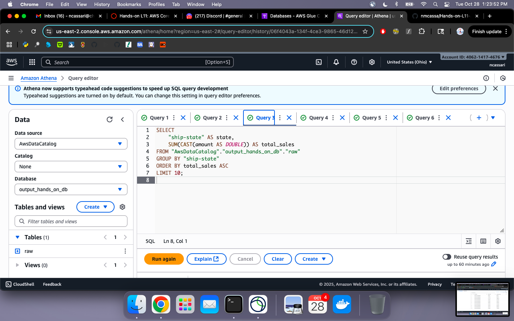

# Hands-on-L11-AWS

## Setup/Approach

I followed the walkthrough in-class. We set up a s3 bucket that contains raw data from kaggle about Amazon sales. Then we created a crawler and a role. Then we created a Glue output database. We then opened up Athena in order to start writing SQL queries on our raw data. Below I have attached the screenshot from the CloudWatch of the Crawler. 

## Query 1: Cumulative Sales Over Time for a Specific Year

## Query 2: Geographic "Hotspot" Analysis for Unprofitable Products

## Query 3: Impact of Discounts on Profitability by Sub-Category

## Query 4: Top 3 Most Profitable Products Within Each Category

## Query 5: Monthly Sales and Profit Growth Analysis:

